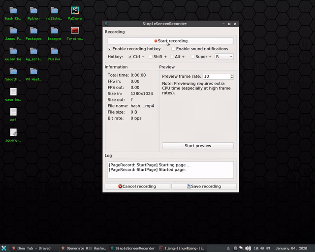

<h1>

Hash-Check

</h1>

 ### Install Instruction: 

1. Clone the this repo. 
    #### `git clone https://github.com/rockstartraders/Hash-Check`

   If git is not installed just download it then extract it to your pc.
 
 
 
 2. After cloning go to the directory.

      #### `cd Hash Check/`

 
 

   3. Install all requirted dependency via PIP.

      #### `Please see Dep.txt`
         I'm using Python Version 3.++ for this so possible that version 2 may not work.

 

  4. Change Permission.

      #### `chmod u+x hash-check.py`
         If permission error occurs you know the drill  [sudo](https://en.wikipedia.org/wiki/Sudo) is the key.

 

5. Just wait for it to finish then run 
      #### `./hash-check.py`

 
 

>>

 ## Demo

 1. Here is a demo. 
  

  

 
